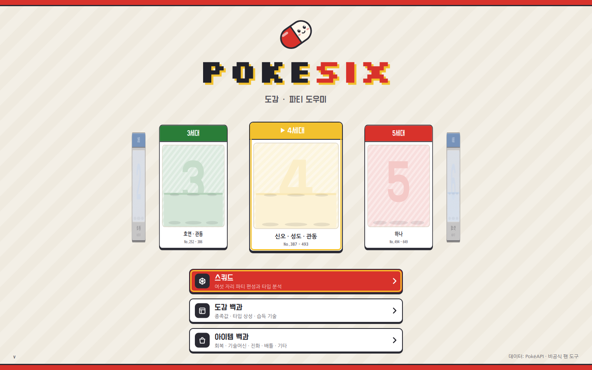
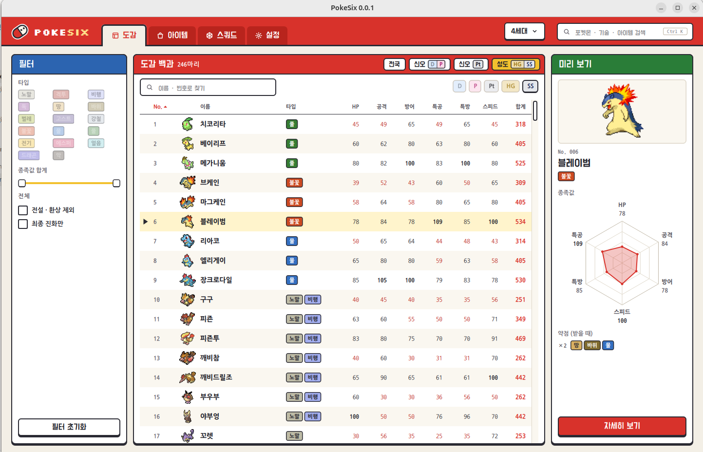
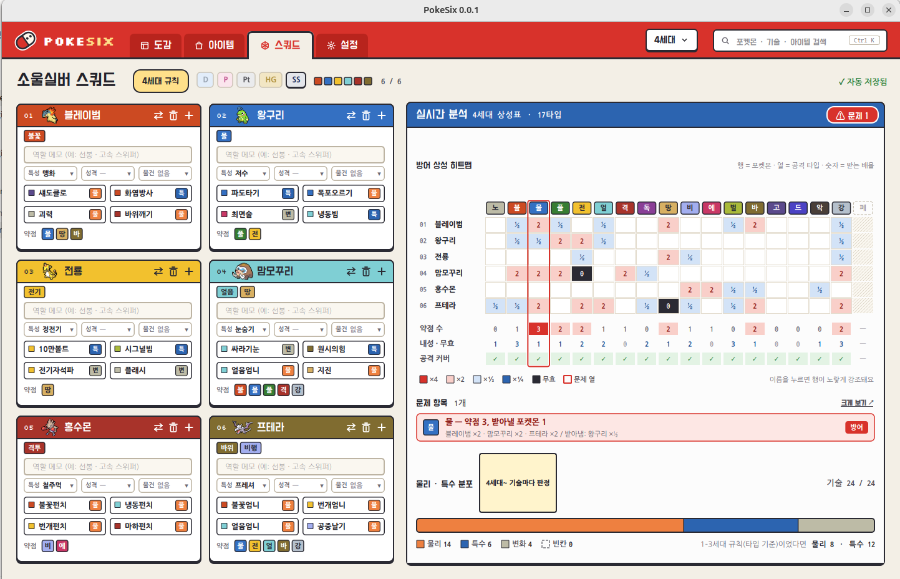
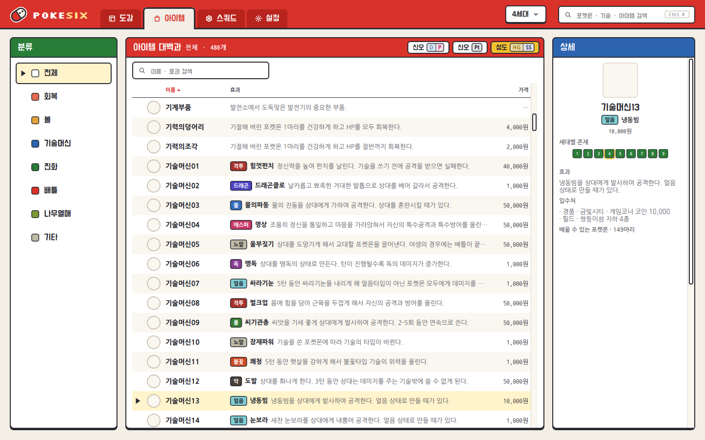

# PokeSix

**A desktop companion for playing through the Pokémon series, one generation and one cartridge at a time.**

PokeSix answers the questions you actually have mid-playthrough — *in the game you are playing*:
what a Pokémon's stats and types are, which moves it can learn and how, where to find an item,
and how your six-member party holds up against every attacking type.



<sub>Screenshots are taken without game pictures — the app downloads Pokémon and item icons on first
use, so they appear blank here.</sub>

> **Status:** early development (v0.2.1). The Pokédex, Squad and Items screens work end to end;
> Settings is not wired up yet. The UI is written in
> Korean first, with English and Japanese translations.

## Contents

- [What it does](#what-it-does)
- [User guide](#user-guide)
  - [1. First launch](#1-first-launch)
  - [2. Pick a generation and a game](#2-pick-a-generation-and-a-game)
  - [3. Pokédex (도감 백과)](#3-pokédex-도감-백과)
  - [4. Squad (스쿼드)](#4-squad-스쿼드)
  - [5. Items (아이템 백과)](#5-items-아이템-백과)
  - [Keyboard shortcuts](#keyboard-shortcuts)
  - [Language](#language)
- [Where the data comes from](#where-the-data-comes-from)
- [Download](#download)
- [Building](#building)

## What it does

| | |
|---|---|
| **Everything follows your game.** | Pick a generation, then the version you are playing (Diamond, Pearl, Platinum, HeartGold, SoulSilver …). Stats, type charts, learnsets, TM numbers, encounters and item locations all switch to that game. Version exclusives you cannot catch are filtered out. |
| **Pokédex** | Base stats, types, abilities, type matchups, evolution chains with their conditions, where to catch it, and every move it learns — level-up, TM/HM, NPC tutors (with their cost) and egg moves. |
| **Squad** | Build a party of six per game. A live heatmap shows weaknesses, missing resistances, ×4 weaknesses and offensive coverage holes as you edit, using that generation's rules. |
| **Items** | Every item of the generation with its effect, where to get it in the chosen game, what it evolves, and — for TMs/HMs — which Pokémon can learn it there. |
| **Offline** | Game data is downloaded once and kept in a local database. |

## User guide

### 1. First launch

Build and start the app (see [Building](#building) — on Linux it is `scripts/linux/build.sh` and
`scripts/linux/run.sh`). The first launch downloads PokéAPI's data files (about 29 MB, pinned to one
commit and checked against SHA-256 hashes) and converts them into a local SQLite database. This takes a
minute; afterwards PokeSix works offline. Pokémon and item pictures are downloaded the first time they
are shown and cached on your computer.

### 2. Pick a generation and a game

On the **home screen** the generation cards stand in a rotating barrel. The front card is the
selected generation — drag the barrel, scroll the mouse wheel, press <kbd>←</kbd> <kbd>→</kbd>, or click a
side card to bring it to the front. Each card shows the starters of every series in that generation
(4th: Sinnoh in front, the HeartGold/SoulSilver Johto starters on the step behind) and the regions it
covers. Then open **Squad**, **Pokédex** or **Items** from the menu below.
<!--  -->
Inside the app, the generation button in the top bar switches generations at any time.

The **game** — the version you are actually playing — is chosen with the version chips on each screen
([D] [P] [Pt] [HG] [SS] on the Squad and Pokédex screens). The choice is shared by every screen and
remembered per generation, so once you pick SoulSilver, the squad, the Pokédex and the Items screen all
open on SoulSilver.

### 3. Pokédex (도감 백과)



- **List.** The header chips choose the dex: [전국] (national, everything up to this generation) or
  a regional dex such as [신오 D|P] or [성도 HG|SS]. The version chips under the header hide Pokémon that
  only the paired version can obtain (in SoulSilver, Mankey and Growlithe are gone). Search by name or
  number, sort by any column.
- **Filters** (left): types, a base-stat-total range, "exclude legendary / mythical" and "final
  evolutions only".
- **Preview** (right): click a row for the stat radar and weaknesses; double-click, press
  <kbd>Enter</kbd> or press **자세히 보기** for the full detail.
- **Detail.**
  - **Stats** with a nature picker — the radar marks the raised ▲ and lowered ▼ stat.
  - **Abilities** and **type matchups** (taken and dealt).
  - **Evolution chain** with every condition. When an item is needed, where to get it in your
    game is written right under the step (e.g. "왕의징표석 — 야돈우물").
  - **Where to catch it** in the chosen version, or which version has it.
  - **Moves**: level-up, TM/HM (with where to get each TM), NPC tutors (with their cost — BP, shards …)
    and egg moves.
  - **Heart Scale mark.** A Heart Scale icon marks level-up moves you can only get from the Move Reminder:
    moves below the earliest level you can obtain the Pokémon at that it does not already know then
    (HeartGold's level-20 fossil Aerodactyl and its level-1 fangs), and level-1 moves of an evolution
    that its earlier stages never learn.

### 4. Squad (스쿼드)



- **One squad per game.** The chips next to the title pick the version; each has its own squad
  ("소울실버 스쿼드"). Click the title to rename it. Changes are saved automatically, and the
  **↶ / ↷ / ⟳** buttons undo, redo or clear the whole squad (clearing is undoable too).
- **Slot cards.** Click an empty card to choose a Pokémon (the list follows the chosen game and warns
  about duplicates). On a filled card set the ability, nature, held item, a role memo and four moves.
  Each assigned move says how that Pokémon learns it, right before the 물/특 badge: `Lv.21` for
  level-up, a Heart Scale icon when it needs the Move Reminder, `TM26`/`HM03` for machines, NPC/알
  for tutor and egg moves. The header buttons are **⇄** (pick another Pokémon), **🗑** (clear the
  slot) and **+** (open the full Pokédex detail in a window, on the squad's game). Drag a card to
  reorder the party.
- **HM shuttle.** The "비전셔틀" button keeps a seventh member that carries field moves (Surf,
  Strength …) so the main six don't waste move slots — the dialog shows, per HM of the game, whether
  the shuttle carries it, a main member burns a slot on it, or nobody has it. It stays out of the
  analysis (and disappears from generation 7 on, where the games replaced HMs with built-in rides).
- **Squad analysis.**
  - **Defensive heatmap**: one row per Pokémon, one column per attacking type, cells show the damage
    taken (×4, ×2, ×½, ×¼, immune).
  - **Totals** per type: weaknesses, resistances and whether your moves hit it super-effectively.
  - **Problems**: types three or more members are weak to, weaknesses nobody resists, ×4 weaknesses
    and coverage holes.
  - **Physical / special split** of your moves, by the generation's rule: by type in generations 1–3,
    by move from the 4th on.
  - **Resource investment**: Heart Scales, TM purchases and tutor fees your move layout costs, with
    warnings when a one-per-game TM is placed on two members and "관동 — 엔딩 후" notes for post-game
    TMs (judged from the acquisition book; fully covered for HGSS so far).
- **Share it.** "내보내기 / 불러오기" move a squad through a portable `.pks` file (another PC's
  PokeSix can import it), and "이미지 ▾" copies or saves the six cards plus the analysis panel as
  one picture.

### 5. Items (아이템 백과)



- **Categories** on the left (recovery, Poké Balls, TMs, evolution, battle, berries, other) and a
  name/effect search.
- **Game chips** in the header pick the game group ([신오 D|P] [신오 Pt] [성도 HG|SS]); TM contents,
  numbers and locations follow it.
- **Detail**: the generations the item exists in, its effect, **where to get it** in that game (shops
  and prices, BP/coin/shard exchanges, field items, gifts; version-only spots are prefixed like "W2 —"),
  the Pokémon it **evolves**, and for TMs/HMs **which Pokémon can learn it** in that game (hover an icon
  for the name; faded icons are exclusive to the other version).

### Keyboard shortcuts

| Keys | Where | Action |
|---|---|---|
| <kbd>←</kbd> <kbd>→</kbd>, mouse wheel | Home | Turn the generation barrel |
| <kbd>Ctrl</kbd>+<kbd>1</kbd> … <kbd>4</kbd> | Main screens | Pokédex · Items · Squad · Settings |
| <kbd>↑</kbd> <kbd>↓</kbd>, <kbd>Enter</kbd> | Pokédex list | Move the preview, open the detail |
| <kbd>Esc</kbd> | Pokédex detail | Back to the list |

### Language

The interface is Korean by default. Start the app with `--language en` or `--language ja` for English
or Japanese (on Linux: `scripts/linux/run.sh -- --language en`). Pokémon, move, item and place names
follow the same language.

## Where the data comes from

- **Game data** — [PokéAPI](https://pokeapi.co)'s published CSV files, pinned to one commit. Stats, types,
  learnsets, evolutions, encounters, TM tables and item data come from here.
- **Korean names and item/tutor locations** that PokéAPI does not have are kept in local dictionaries
  under `resources/data/`. Locations are facts researched from community guides (Serebii's ItemDex,
  a Korean walkthrough blog) and rewritten in PokeSix's own structured format — no guide text is
  copied — with names cross-checked against the game text. Coverage is best for the 4th generation
  (Platinum, HeartGold/SoulSilver); some places in other games are still in English. See
  [docs/i18n/README.md](docs/i18n/README.md).

## Download

Prebuilt packages for every OS are on the
[**Releases** page](https://github.com/yamada-studio/PokeSix/releases) — no Qt, compiler or
setup needed. SHA-256 checksums are in each release's notes.

| OS | File | How to run |
|---|---|---|
| Windows (installer) | `PokeSix-<version>-win64.msi` | Run it — Start-menu shortcut included; a newer msi upgrades in place. SmartScreen warns about an unknown publisher the first time: **More info → Run anyway**. |
| Windows (portable) | `PokeSix-<version>-win64.zip` | Extract anywhere, run `bin\PokeSix.exe`. Same SmartScreen note. |
| Linux | `PokeSix-<version>-x86_64.AppImage` | `chmod +x`, then run it. |
| macOS | `PokeSix-<version>-macos.dmg` | Clear the quarantine flag first (below), then open the dmg and drag the app to Applications. |

**macOS says the app "is damaged and can't be opened"?** It is not damaged. The app is not
notarized with Apple (that requires a paid developer account), so macOS quarantines anything a
browser downloads and, on Apple Silicon, shows this message for ad-hoc-signed apps — there is no
"Open Anyway" button for it and the right-click → Open trick does not apply. Clear the flag once:

1. Eject the mounted PokeSix image (the dialog's only button does that).
2. In Terminal:
   ```bash
   xattr -d com.apple.quarantine ~/Downloads/PokeSix-<version>-macos.dmg
   ```
3. Open the dmg again and drag PokeSix to Applications.

If the app is already in Applications, clear it there instead: `xattr -cr /Applications/PokeSix.app`.
Downloading with `curl -LO <release asset URL>` instead of a browser avoids the flag altogether.
The same steps are in `READ ME FIRST - macOS.txt` inside the dmg.

## Building

Requirements: a C++20 compiler, CMake 3.21+, Ninja (Linux/macOS), and **Qt 6.8 or newer**
(Widgets, Svg, Sql, Network).

**Quick start** — one script does everything after a fresh clone: dependencies (incl. Qt 6.8.3),
release build with tests, a package, and launches it.

```bash
git clone https://github.com/yamada-studio/PokeSix.git
cd PokeSix
scripts/linux/quickstart.sh         # Linux: setup → build → AppImage (+ app menu) → run
```
```bat
scripts\windows\quickstart.bat      # Windows: setup → build → portable ZIP → run
```
```bash
scripts/macos/quickstart.sh         # macOS: setup → build → .dmg → run
```

Add `--no-run` to stop after packaging. On Linux the AppImage is also registered in the
desktop's application menu (`~/.local/bin/PokeSix.AppImage` + a `.desktop` entry — rerun
`scripts/linux/package.sh --install` to refresh it). The result is a real distributable:
`build/package/PokeSix-<version>-x86_64.AppImage` on Linux,
`build\windows-msvc\package\PokeSix-<version>-win64.zip` on Windows (the extracted folder's
`bin\PokeSix.exe` runs on a PC without Qt), and `build/package/PokeSix-<version>-macos.dmg` on
macOS (a copy you built yourself opens normally; a *downloaded* copy needs the Gatekeeper step
in [Download](#download)).

Each step also exists on its own, one folder per OS:

| | Linux (Ubuntu 24.04) | macOS | Windows (MSVC 2022) |
|---|---|---|---|
| Install dependencies (incl. Qt 6.8.3) | `scripts/linux/setup.sh` | `scripts/macos/setup.sh` | `scripts\windows\setup.bat` |
| Configure, build, test | `scripts/linux/build.sh` | `scripts/macos/build.sh` | `scripts\windows\build.bat` |
| Run a dev build | `scripts/linux/run.sh` | `scripts/macos/run.sh` | `scripts\windows\run.bat` |
| Package (AppImage / ZIP / DMG) | `scripts/linux/package.sh` | `scripts/macos/package.sh` | `scripts\windows\package.bat` |

```bash
scripts/linux/build.sh      # debug build + tests;  add `release`, `--clean`, `--install <prefix>`
scripts/linux/run.sh        # builds first if needed; `--help` for options
```

Prefer plain CMake? Set `QT_ROOT_DIR` to your Qt folder (e.g. `~/Qt/6.8.3/gcc_64`) and use the presets:
`cmake --preset linux-debug && cmake --build --preset linux-debug && ctest --preset linux-debug`.

Windows (MSVC 2022), Homebrew Qt, IDE setup and common errors are covered in
**[docs/build.md](docs/build.md)**. Running the app from the command line and shipping a Windows `.exe`
are covered in **[docs/deploy.md](docs/deploy.md)**.

> Ubuntu 24.04's `apt` ships Qt 6.4, which is too old. Use the script above or the Qt online installer.

## Project layout

```
src/core/   pure C++20 domain logic — type chart, generation rules, team analysis (no Qt)
src/data/   PokéAPI client, SQLite cache, repositories, Qt item models
src/ui/     Qt Widgets screens and reusable widgets
src/app/    main window and application bootstrap
tests/      unit tests (GoogleTest) and a Qt runtime environment check
tools/      developer command-line tools (e.g. pokesix-fetch-csv: download the pinned PokéAPI CSV files)
resources/  app icons, bundled fonts, style sheets (Qt resource system)
docs/       architecture, build guide, conventions, roadmap, decision records
design/      visual design packages from Claude Design (handoff-v1, handoff-v2) and design requests
```

See [docs/architecture.md](docs/architecture.md) for the layering rules.

## License

PokeSix's source code, documentation and original artwork are released under the
[MIT License](LICENSE). Third-party material — Pokémon names and game text, PokéAPI data, the
sources behind the item-location dictionaries, Qt and the bundled fonts — keeps its own terms; see
**[THIRD_PARTY_NOTICES.md](THIRD_PARTY_NOTICES.md)**.

### Third-party software

- **Qt 6** — used under the [GNU LGPL v3](https://www.gnu.org/licenses/lgpl-3.0.html).
  PokeSix links to Qt dynamically and does not modify it, so you can replace the Qt
  libraries with any compatible build. Qt source code is available from
  <https://download.qt.io> and <https://code.qt.io>.
- **GoogleTest** — BSD-3-Clause. Downloaded at build time for tests only; not part of the application.
- **Fonts** — Do Hyeon, Nanum Gothic, Nanum Gothic Coding and Silkscreen, bundled under the
  [SIL Open Font License 1.1](https://openfontlicense.org). License texts are in `resources/fonts/OFL-*.txt`.

### Data

Pokémon data is provided by [PokéAPI](https://pokeapi.co), created by Paul Hallett and
the PokéAPI contributors. PokeSix follows PokéAPI's
[fair use policy](https://pokeapi.co/docs/v2): it never queries the API servers; it downloads
the published CSV files once, caches them locally and only downloads again when you ask for an update.

### Assets policy

This repository contains **no game assets**. Sprites, artwork, sounds and other
material from the Pokémon games are copyrighted by their owners and are never
committed here. Any such content is downloaded at runtime to your local cache for
personal use. Icons and styles under `resources/` are original to this project.
The screenshots in `docs/screenshots/` are captured without any game pictures (the app
downloads them at runtime, so the Pokémon and item icons are blank there).

## Disclaimer

PokeSix is an unofficial fan project. It is not affiliated with, endorsed by, or
sponsored by Nintendo, Creatures Inc., GAME FREAK inc., or The Pokémon Company.
Pokémon and Pokémon character names are trademarks of Nintendo.
