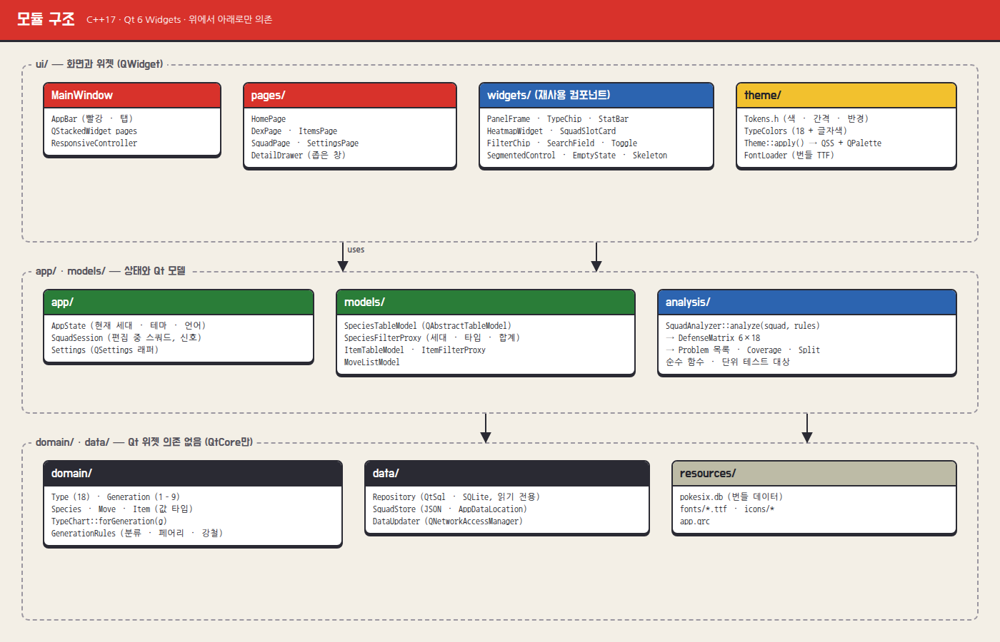
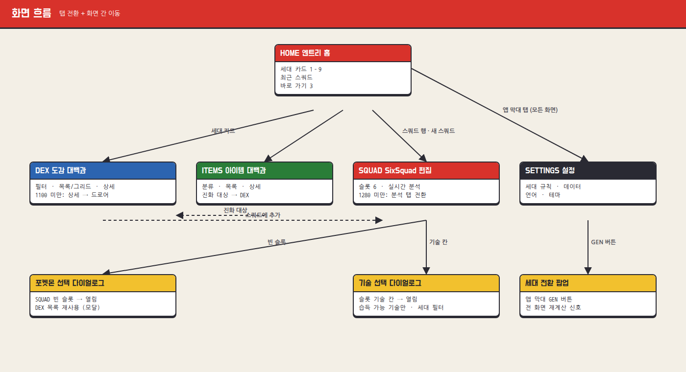
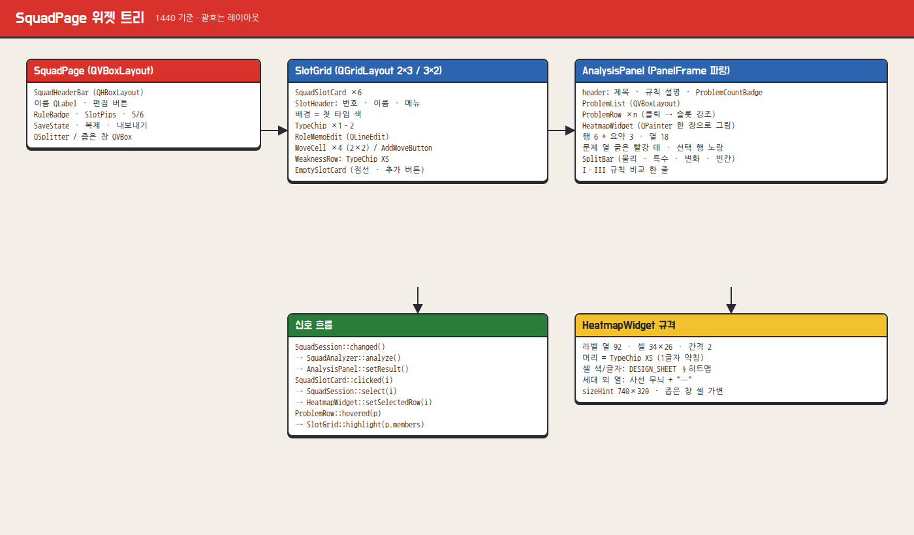
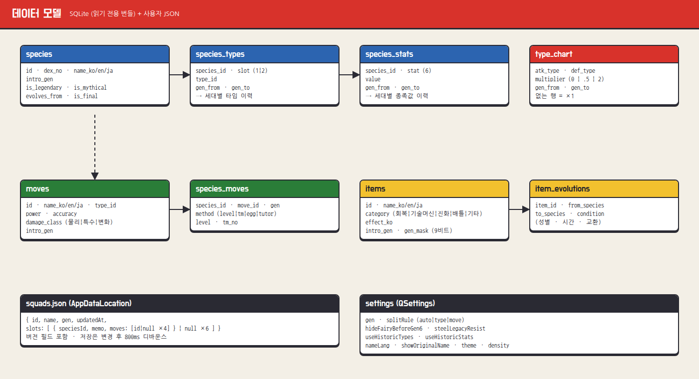

# 03 · 설계서

> 저장소에 이미 구조가 있다면 그 구조를 존중하고, 이 문서는 "역할이 어디에 있어야 하는가"의 기준으로 쓴다.

## 1. 모듈 구조



의존은 **위에서 아래로만**: `ui → app/models/analysis → domain/data`. `domain/`, `analysis/`, `data/`는 QtCore(+QtSql)만 쓰고 QtWidgets를 포함하지 않는다 → 단위 테스트가 가볍다.

```
src/
├─ main.cpp
├─ app/        AppState, SquadSession, Settings
├─ theme/      Tokens.h, TypeColors.{h,cpp}, Theme.{h,cpp}, FontLoader.{h,cpp}
├─ domain/     Type.h, Generation.h, Species.h, Move.h, Item.h, TypeChart.{h,cpp}, GenerationRules.{h,cpp}
├─ analysis/   SquadAnalyzer.{h,cpp}, AnalysisResult.h
├─ data/       Repository.{h,cpp}, SquadStore.{h,cpp}, DataUpdater.{h,cpp}
├─ models/     SpeciesTableModel, SpeciesFilterProxy, ItemTableModel, ItemFilterProxy, MoveListModel
└─ ui/
   ├─ MainWindow.{h,cpp}, AppBar, AppTabBar, ResponsiveController
   ├─ pages/   HomePage, DexPage, ItemsPage, SquadPage, SettingsPage, DetailDrawer
   └─ widgets/ PanelFrame, TypeChip, StatBar, HeatmapWidget, SquadSlotCard, EmptySlotCard,
               FilterChip, SearchField, ToggleSwitch, SegmentedControl, RangeSlider,
               EmptyState, SkeletonRows, SegmentProgress, SpritePlaceholder
resources/     app.qrc, fonts/, icons/ (앱 아이콘 + ui/*.svg), data/pokesix.db
tests/         tst_typechart, tst_rules, tst_analyzer, tst_squadstore
```

CMake 타깃: `pokesix_core`(domain · analysis · data · models, 정적 라이브러리) · `pokesix`(실행 파일) · `tests/*`(QtTest, core에만 링크).

## 2. 화면 흐름



- `MainWindow` = `AppBar` + `QStackedWidget`(페이지 5). 페이지는 처음 열 때 생성(lazy).
- 다이얼로그 3종: 포켓몬 선택(도감 목록 재사용, 모달) · 기술 선택 · 세대 전환 메뉴.

## 3. 상태와 신호

```cpp
class AppState : public QObject {            // 앱 전역, 싱글턴 아님 — MainWindow가 소유하고 주입
  Q_OBJECT
  Q_PROPERTY(int generation READ generation WRITE setGeneration NOTIFY generationChanged)
public:
  GenerationRules rules() const;             // gen + 설정 토글을 합친 결과
signals:
  void generationChanged(int gen);
  void rulesChanged();                       // 설정 토글 변경 포함
  void themeChanged(Theme::Mode);
};

class SquadSession : public QObject {       // 편집 중인 스쿼드 하나
  Q_OBJECT
public:
  const Squad& squad() const;
  void setSlot(int i, std::optional<SlotData>);
  void setMove(int slot, int moveIndex, std::optional<MoveId>);
  void select(int slot);
signals:
  void changed();                            // → SquadAnalyzer 재계산 → AnalysisPanel 갱신, SquadStore 저장 예약(800ms)
  void selectionChanged(int slot);
};
```

SquadPage 위젯 트리와 신호 흐름:



## 4. 분석 엔진

```cpp
struct DefenseRow { SpeciesId id; std::array<std::optional<double>, 18> mult; }; // nullopt = 세대 외 타입
struct Problem { enum Kind { WeakStack, NoCounter, Quad, NoCoverage } kind; Type type; QList<int> slots; };
struct AnalysisResult {
  QList<DefenseRow> rows;                    // 채워진 슬롯만
  std::array<int, 18> weakCount, resistCount; // resist = ×½, ×¼, ×0
  std::array<std::optional<bool>, 18> covered; // 효과가 굉장한 공격 기술 보유 여부
  QList<Problem> problems;                   // 정렬: WeakStack/NoCounter → Quad → NoCoverage
  int physical, special, status, empty;      // 현재 세대 규칙
  int altPhysical, altSpecial;               // 반대 규칙(1–3 ↔ 4+)이었다면
};
AnalysisResult SquadAnalyzer::analyze(const Squad&, const GenerationRules&, const Repository&);
```

- 방어 배율 = 방어 타입 1·2의 배율 곱. 입력 타입은 `useHistoricTypes`면 선택 세대 당시 타입.
- 문제 판정(디자인 시트 §5-5): 약점 ≥ 3 → `WeakStack`, 약점 ≥ 2 & 내성 0 → `NoCounter`, 멤버 ×4 → `Quad`, 커버 false → `NoCoverage`.
- 커버: 공격 기술(변화 제외)의 타입 중 하나라도 해당 방어 타입에 ×2 이상이면 true.
- 순수 함수. 6×18 계산이라 UI 스레드에서 동기 호출해도 된다.
- 규칙 세부와 테스트 값: `04_RULES_AND_TESTS.md`.

## 5. 데이터



```sql
CREATE TABLE species (id INTEGER PRIMARY KEY, dex_no INTEGER NOT NULL, name_ko TEXT, name_en TEXT, name_ja TEXT,
  intro_gen INTEGER NOT NULL, is_legendary INTEGER DEFAULT 0, is_mythical INTEGER DEFAULT 0,
  evolves_from INTEGER REFERENCES species(id), is_final INTEGER DEFAULT 0);
CREATE TABLE species_types (species_id INTEGER, slot INTEGER, type_id INTEGER, gen_from INTEGER, gen_to INTEGER);
CREATE TABLE species_stats (species_id INTEGER, stat INTEGER, value INTEGER, gen_from INTEGER, gen_to INTEGER);
CREATE TABLE type_chart (atk_type INTEGER, def_type INTEGER, multiplier REAL, gen_from INTEGER, gen_to INTEGER);
CREATE TABLE moves (id INTEGER PRIMARY KEY, name_ko TEXT, name_en TEXT, name_ja TEXT, type_id INTEGER,
  power INTEGER, accuracy INTEGER, damage_class INTEGER, intro_gen INTEGER);
CREATE TABLE species_moves (species_id INTEGER, move_id INTEGER, gen INTEGER, method INTEGER, level INTEGER, tm_no INTEGER);
CREATE TABLE items (id INTEGER PRIMARY KEY, name_ko TEXT, name_en TEXT, name_ja TEXT, category INTEGER,
  effect_ko TEXT, intro_gen INTEGER, gen_mask INTEGER);           -- gen_mask: 비트 0 = 1세대 … 비트 8 = 9세대
CREATE TABLE item_evolutions (item_id INTEGER, from_species INTEGER, to_species INTEGER, condition TEXT);
```

- `gen_to` NULL = 현재까지 유효. 세대 g의 값은 `gen_from <= g AND (gen_to IS NULL OR gen_to >= g)`.
- DB는 리소스에서 사용자 데이터 폴더로 복사해 읽기 전용으로 연다. `DataUpdater`는 새 DB를 임시 파일로 받아 검증 후 교체.
- 스쿼드: `QStandardPaths::AppDataLocation/squads.json`
  ```json
  { "version": 1, "squads": [ { "id": "uuid", "name": "신오 정주행", "gen": 4, "updatedAt": "ISO-8601",
      "slots": [ { "speciesId": 392, "memo": "선봉 · 고속 혼합 어태커", "moves": [53, 370, 369, 183] }, null ] } ] }
  ```
- **데이터 원본은 미정.** 원본을 정하면 가져오기 스크립트(`tools/import_*`)를 따로 만든다. 그 전엔 `tools/seed.sql`에 목업에 나온 포켓몬 · 기술 · 아이템만 넣는다(값은 `design/source/Dex.dc.html`, `Squad.dc.html`, `Items.dc.html`의 `renderVals()` 배열).

## 6. 테마 적용

- `Theme::apply(QApplication&, Mode)` — `design/pokesix.qss`의 `@토큰`을 `Tokens.h` 값으로 치환해 `setStyleSheet`, `QPalette`도 같이 설정.
- 커스텀 페인트 위젯은 `Theme::color(Token)`만 읽는다. 테마 변경 시 `themeChanged` → `update()`.
- 글꼴: `FontLoader::loadBundled()`가 `:/fonts/*.ttf`를 `QFontDatabase::addApplicationFont`로 등록. 역할별 `QFont`는 `Theme::font(Role)`에서.
- HiDPI: `Qt::AA_EnableHighDpiScaling`은 Qt 6 기본. 1px 선은 `QPen` 폭 1 + `setCosmetic(true)`가 아니라 **논리 px 그대로**(2px 먹선은 2 논리 px).

## 7. 반응형 `ResponsiveController`

```cpp
enum class WidthClass { Wide /*≥1360*/, Medium /*1100–1359*/, Narrow /*1024–1099*/, Min /*960–1023*/ };
```
- `MainWindow::resizeEvent` → 폭 구간이 바뀔 때만 `widthClassChanged(WidthClass)` 발신(히스테리시스 16px).
- 각 페이지가 구간별 배치를 직접 바꾼다(`QSplitter` 패널 접기, 드로어 전환, 그리드 열 수). 레이아웃을 새로 만들지 말고 위젯을 재배치.
- 최소 창 `setMinimumSize(960, 640)`.

| 화면 | Wide | Medium | Narrow · Min |
|---|---|---|---|
| 앱 막대 | 워드마크 + 탭 5 + 검색 입력 | 동일 | 마크만 · 설정 탭 아이콘 · 검색 아이콘 버튼 |
| 도감 | 필터 · 목록 · 상세 | 필터 → 칩 바 | + 상세 → 드로어 380 |
| 아이템 | 분류 · 목록 · 상세 | 분류 → 세그먼트 | + 상세 → 드로어 |
| 스쿼드 | 슬롯 2×3 + 분석 오른쪽 (1280 이상) | 1280 미만: 슬롯 3×2 위 + 분석 탭 아래 | 동일 |
| 설정 | 목록 · 2열 | 1열 스택 | 목록 → 상단 세그먼트 |

## 8. 테스트와 검증

- QtTest: `tst_typechart`(세대별 표), `tst_rules`(분류 · 페어리 · 강철), `tst_analyzer`(04 문서의 샘플 스쿼드 전 값), `tst_squadstore`(저장 · 불러오기 · 버전).
- 화면 캡처: `pokesix --screenshot squad 1440x900 out.png` → `images/screens/14_squad_1440.png`와 비교. 1024×768도 동일.
- 접근성: 모든 페이지 Tab 순회 확인, 아이콘 버튼 `accessibleName`, 토글은 `QAccessible::CheckBox` 역할로 노출.
