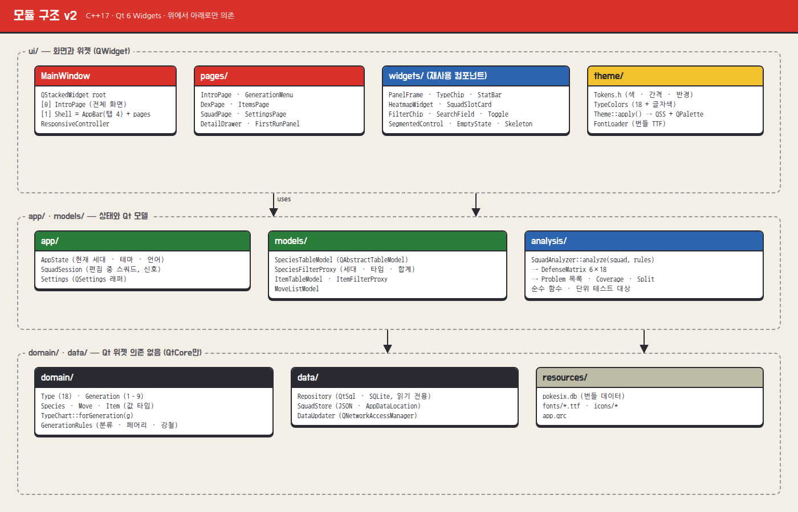
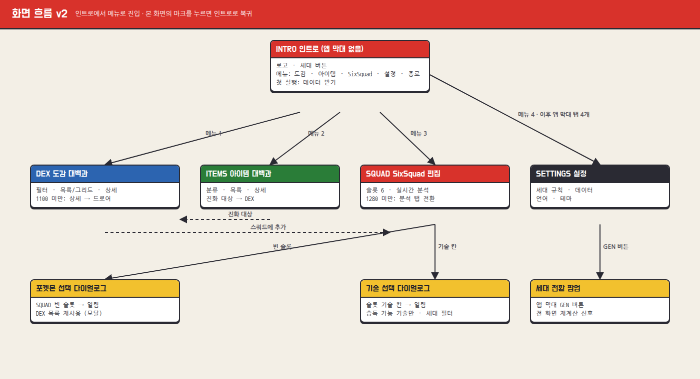

# 03b · 설계서 v2 (바뀐 부분만)

v1 `03_ARCHITECTURE.md`에 아래를 적용한다.




## 1. 화면 구조

```
MainWindow
└─ QStackedWidget  root
   ├─ [0] IntroPage          ← 앱 시작 시 항상 여기
   └─ [1] Shell (QWidget, QVBoxLayout)
         ├─ AppBar            탭 4 (Dex · Items · Squad · Settings) + MarkButton → root.setCurrentIndex(0)
         └─ QStackedWidget  pages   [DexPage, ItemsPage, SquadPage, SettingsPage]
```

- `HomePage`, 관련 위젯(세대 카드 그리드 · 최근 스쿼드 목록 · 바로 가기)은 **삭제**. 최근 스쿼드 목록이 필요하면 스쿼드 화면 쪽 기능으로 옮길지 사용자에게 먼저 묻는다.
- `enum class Page { Dex, Items, Squad, Settings }` — `MainWindow::open(Page)`가 root를 Shell로 바꾸고 탭 · 페이지를 맞춘다.

```cpp
class IntroPage : public QWidget {
  Q_OBJECT
public:
  explicit IntroPage(AppState*, DataUpdater*, QWidget* parent = nullptr);
signals:
  void openRequested(Page page);
  void quitRequested();
};
```

## 2. IntroPage 구성

| 위젯 | 역할 |
|---|---|
| `IntroBackground` | paintEvent: 사선 무늬 타일 + 위아래 빨강 띠 |
| `MarkWidget` | 캡슐 마크를 크기 규칙대로 그림(§01b 6-3). `setSizeClass()` 로 136 / 100 / 72 |
| `WordmarkLabel` | Silkscreen 텍스트를 그림자 오프셋과 함께 두 번 그림 |
| `GenerationButton` + `GenerationMenu` | v1 앱 막대의 것을 재사용(큰 크기 변형). `AppState::setGeneration` |
| `FirstRunPanel` | 3단계 상태(받기 전 · 받는 중 · 실패). `DataUpdater` 신호에 연결 |
| `IntroMenu` | 메뉴 줄 목록. 선택 인덱스를 직접 관리(QListView 아님) — hover가 선택을 옮기고, 잠긴 줄은 건너뜀. `activated(int)` |
| `IntroFooter` | 버전 · 키 안내 · 출처 |

키 처리는 `IntroPage::keyPressEvent` 한 곳에서: ↑↓ → `IntroMenu::move(±1)`, Enter → activate, 1–4 → 직접 activate, Esc → 종료 줄 선택 / 두 번째 Esc → `quitRequested`.

반응형: `ResponsiveController::widthClassChanged` → IntroPage가 `Wide / Narrow / Min` 세 가지 배치(02b 반응형 표)로 전환. 레이아웃은 한 번 만들고 크기 · 방향만 바꾼다(960에서 마크 + 워드마크를 QHBoxLayout으로).

## 3. 첫 실행 흐름

```
앱 시작 → Repository::hasData()?
  ├─ 예  → IntroMenu 전부 사용 가능
  └─ 아니오 → FirstRunPanel(①) 표시, IntroMenu.setLocked({Dex, Items, Squad})
             "데이터 받기" → DataUpdater::start()  → ②   (progress(step,total,label))
             failed(code) → ③ "다시 시도" → start()
             finished()  → Repository::reload() → 패널 숨김 · 잠금 해제 · 선택 = 도감
```

`DataUpdater`는 받은 단계를 기록해 두고 재시작 시 이어서 받는다(②의 "창을 닫아도 다음에 이어서 받아요" 문구 근거).

## 4. 아이콘 연결

| OS | 설정 |
|---|---|
| macOS | `set(MACOSX_BUNDLE_ICON_FILE PokeSix.icns)` + 리소스 복사 |
| Windows | `app.rc`: `IDI_ICON1 ICON "pokesix.ico"` |
| Linux | `install(DIRECTORY assets/icons/linux/hicolor DESTINATION share/icons)` + `.desktop`의 `Icon=pokesix` |
| 공통 | `QApplication::setWindowIcon(QIcon(":/icons/app/pokesix-256.png"))` — 여러 크기를 `QIcon::addFile`로 추가 |

## 5. 스크린샷 모드 추가

`--screenshot intro <w>x<h> out.png`, `intro-gen-open`, `intro-first-run`(① 상태 강제), 기존 대상은 그대로.
